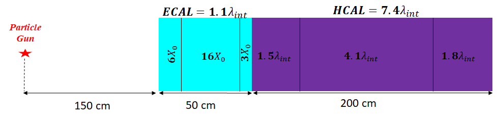
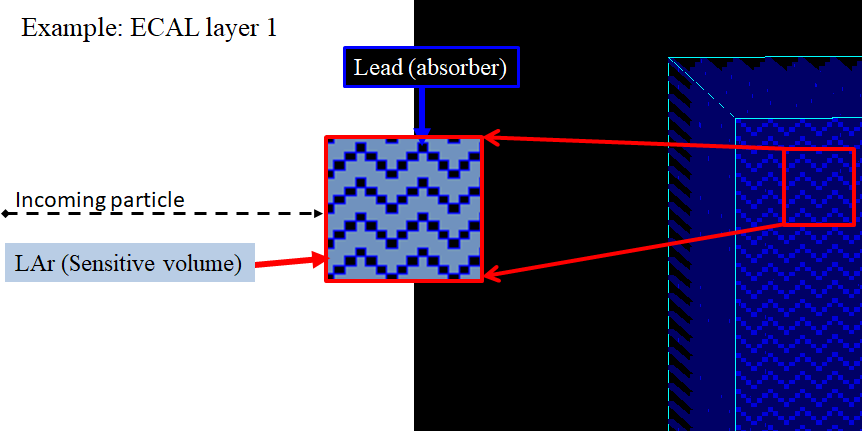
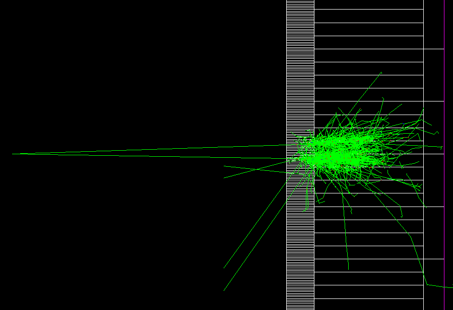
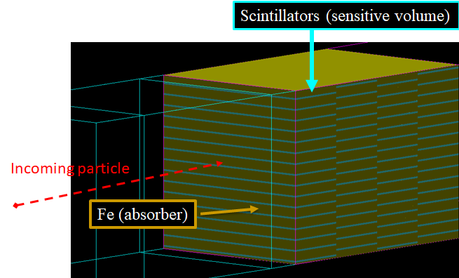
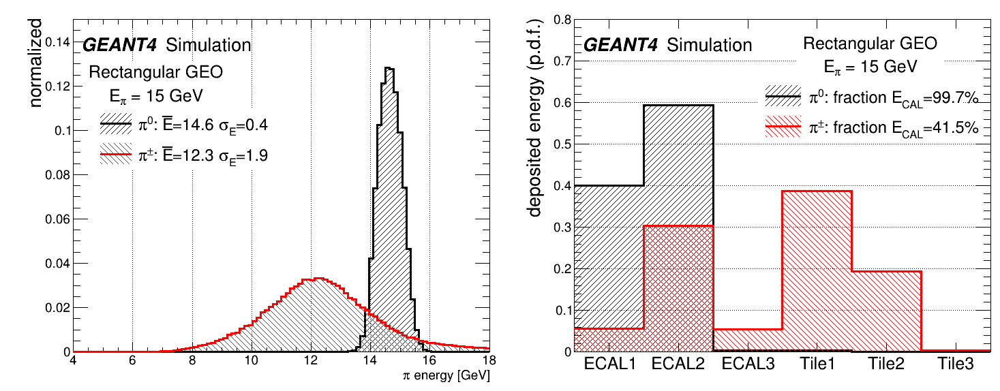

# Simplified ATLAS calorimeter geometry

A (very) simplified version of [ATLAS detector](https://iopscience.iop.org/article/10.1088/1748-0221/3/08/S08003) calorimeter incorporating the concept of a sampling calorimeter.

### Instalation and execution
```bash
export Geant4_DIR=PATH_TO_GEANT4_INSTALL
#if using CERN/CVMFS with CENTOS7
#source setupCVMFS.sh
mkdir build; cd build
cmake ../ATLAS-simplified; make -j
```

## Geometry description:

Full technical details on the electro-magnetic calorimeter (ECAL) design can be found in [ECAL ref](https://cds.cern.ch/record/331061/files/CERN-LHCC-96-41.pdf)
and on hadronic calorimeter (HCAL) design can be found in [HCAL ref](https://cds.cern.ch/record/2004868/files/ATL-TILECAL-PROC-2015-002.pdf).

The detector granularity matches ATLAS geometry at &eta;=0 (barrel). The detector composited from 6 layers:
3 form the Electro-Magnetic Calorimeter and 3 forms the Hadronid Calorimeter.
A side view of the detector setup is shown in Fig. 1.



### ECAL geometry:

Electro-Magnetic calorimeter composed of 3 layers. It consists of passive layers,
1.5 mm each of lead (Pb) and a 4.5 mm gap of liquid argon (LAr) used as a sensitive layer. The passive lead layers are placed in accordion geometry shape, and the gaps were filled with LAr, as shown in Fig 2.



The energy resolution of ECAL geometry was simulated to be &sigma;/E=6.5%/&radic;E, which is controlled by electro-magnetic energy
 sampling fraction of about 25%.
 
Cell granularity was defined similar to ATLAS ECAL granularity at &eta;=0:

| Layer  | dx X dy \[mm<sup>2</sup>\]| d&eta; X d&phi; | total X<sub>0</sub> |
| ------------- | ------------- | ------------- | ------------- |
| ECAL 1  | 4.5 X 144  | 0.025/8 X 0.1 | 6 |
| ECAL 2  | 36 X 36  | 0.025 X 0.025 | 16 |
| ECAL 3  | 144 X 144  | 0.1 X 0.1 | 3 |

Exapmle of di-photon from 2 GeV &pi;<sub>0</sub> decay infront of the EM calorimeter is shown in Fig 3.



### HCAL geometry

Hadronic calorimeter composed of 3 layers. It consists of passive layers,
5 mm each of stainless steel (Fe) and a 1 mm gap of the plastic scintillator (4-Vinyltoluene) used as a sensitive layer. Inside the passive
region in parallel to the beam axis, the plastic scintillators are places, as shown in Fig 4.



The energy resolution of HCAL geometry was simulated to be &sigma;/E=35%/&radic;E, which is controlled by electro-magnetic energy
 sampling fraction of about 2%.

Cell granularity was defined similar to ATLAS HCAL granularity at &eta;=0:

| Layer  | dx X dy \[mm<sup>2</sup>\]| d&eta; X d&phi; | total &lambda;<sub>int</sub> |
| ------------- | ------------- | ------------- | ------------- |
| HCAL 1  | 144 X 144  | 0.1 X 0.1 | 1.5 |
| HCAL 2  | 144 X 144  | 0.1 X 0.1 | 4.1 |
| HCAL 3  | 288 X 288  | 0.2 X 0.2 | 1.8 |

## Energy response

ECAL and HCAL were calibrated at EM scale, and a constant calibration factor of C<sub>ECAL</sub>=3.682 
and C<sub>HCAL</sub>=42.006 were extracted respectively, 
by shooting electrons in an energy range between 10 to 50 GeV. In addition for HCAL a scintillator response ratio between em and had shower components was taken to be 1:0.2 (to match e/h=1.47)
 
The detector energy resolution for 15 GeV pions is shown in Fig 5.




## Output

The output is a ROOT file that contains `vector<float>` of cell energy and coordinates, as well as the information about primary particles.
In `src/RunAction.cc` implemenation of saving vectors in ROOT file using CreateNtupleDColumn of GEANT4 G4AnalysisManager instance is shown.

